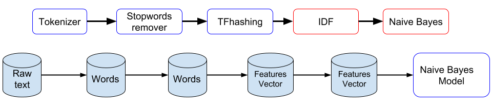
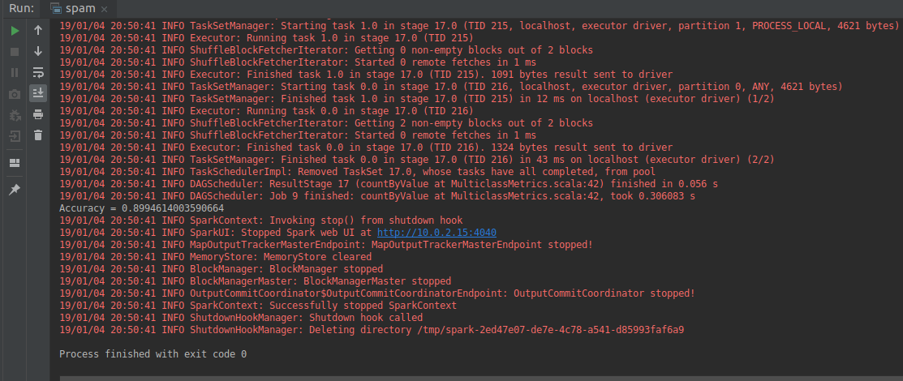
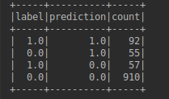

# Email spam filtering in Apache Spark.

We use Apache Spark’s ML libraries to build an email spam filtering, binary classifier (i.e., text-messages are classified as either spam or no spam). For that purpose, we take a dataset of labeled text messages from the UCI Machine Learning Repository [Link](https://archive.ics.uci.edu/ml/datasets/sms+spam+collection) that was randomly split into a training- and test-dataset.

##  Dataset Exploration

The model is trained and evaluated based on the already provided datasets.  It is normal that as a first step to explore the dataset to understand what are the problems with the data and how can we handle them. There are in total 4460 (3862 no-spam and 598 spam) lines for the training dataset.  Onthe other hand the model is evaluated on the test dataset which has in total 1114 (965 no-spam and 149 spam).  So, there is a split 80% for training and 20% for testing.  The provided datasets are not having a label as a separate column so, a new column is added to the dataframe.  The new column  is  named  “label“  and  has  the  value  1.0  when  the  message  is  spam  and  0.0  for  no-spam.The class spam/no-spam can easily be distinguished from the fact that the provided datasets are already separated.  The label column it is required to evaluate the model in the last step.

The dataset exploration shows that we have some problems as in the below list.
  - Slangs are present.

  - There exist words abbreviations.

  - There exist misspelled words.

  - There exist union of words (no space separation).

  - More than one space is used to separate the words.

  - Grammar rules are not followed always.

Part of the problems relates to the fact that the original dataset contains SMS texts and not emails.It is common for SMS texts to contain informal language and a lot of abbreviations.  Such problems impacts in the algorithm accuracy in case the mentioned problems are not handled properly.

## Feature Extraction and Transformation

**Tokenizer**

The spam filter model that we want to implement can’t be trained
directly on sentences because it has very low probability that all spam
emails are identical. We will use a different approach which is
splitting each sentence in words. The technique used is named Tokenizer.
The words of each sentence after the split will be the terms on which we
train the model for our spam filter. The details of such implementation
will be clearer during the coming sections when the Bag-of-words and
TF-IDF concepts are explained. The code implementation is using a
Tokenizer that accepts regex expressions (RegexTokenizer) to split the
words. The RegexTokenizer class is overcoming one of the problems of our
dataset mentioned at subsection
[\[DatasetExploration\]](#DatasetExploration) that is taking in
consoderation when words are splitted by more than one space. This class
is preventing the existence of “empty“ words in cases where there is a
big “gap“ between the words.

**Stopwords**

There exist a lot of languages, English included, that contain some
words as part of the sentence which does not contribute in the meaning
or has no specific importance to the context of the sentence. These
words are named “stopwords“, and it is normal to remove them during the
pre-processing step while doing NLP. Some example of stopwords are `the,
is, in, at, which, on, that, etc.` There is no definitive list of
stopwords because they relate to the domain of application. For
instance, in an Anti-Money Laundry (AML) application some cities name
may create a significant number of false positives while doing customer
address checking and they are removed by being placed as stopwords. The
case of our application will not go in such in-depth details but is
using the library provided by Spark ML library to remove English
stopwords.

**Bag-of-words and N-grams**

Bag-of-words is a technique widely used to extract features from a text
document. The bag is created by splitting a document into words (grams)
and for each of these words calculate the frequency of appearance in a
document (in our case the documents are the SMS texts). The group of all
the words will form the vocabulary of the documents. The name bag comes
from the fact that the technique does not take in consideration the
order of the words in the document or their relation from the
grammatical point of view of the language. The result of Bag-of-words is
a vector representing the vocabulary and the frequencies of each word.
This technique comes with a problem of data sparsity because the
vocabulary is much bigger than the number of different words that
contains each document. We will use a techniques called TFhashing to
solve this issue. The explanation is provided in subsection
[\[TFhashing\]](#TFhashing).

An N-gram is using the same concept as the Bag-of-Words but instead of
taking a single word it takes N consecutive words which are the new
terms for our vocabulary. The increasing number of N can detect more
expressiveness from the language of the message but not always can
result in better accurancy. For instance, in our case we tried
bigrams(N=2) and trigrams(N=3) but the algorithm accuracy decreased.
This is coming from the fact that the messages are very short because
they are SMS text and after removing the the stopwords the number of
words is even smaller. The organization of the words of these sentences
in N-grams in such case is decreasing the accuracy because we loose some
information coming from the single words. So, finally we are using
unigrams (N=1) which is the same as the concept of the Bag-of-words.

**TF-IDF and TFhashing**

The Bag-of-words technique can be implemented by calculating the terms
(words) frequency and returning it as a vector of values as explained in
the previous section. Such implementation is not the best approach
because it taking in consideration the terms frequency in only one
document and not in the collection of documents. A better approach is to
implement TF-IDF that stands for terms frequency-inverse document
frequency. TF-IDF score is a statistical measure that evaluates the
importance of each term in a document by taking in consideration the
collection of all documents. The importance increases when the
appeareance of the term increases but this increase is proportion with
the increase of the term in the collection of documents. So, IDF is
calculating how rare the score of a term is between documents. TF-IDF
score uses the below formulas where t is the term and D is the
collection of documents.

We use TFhashing class of Spark ML to calculate the TF part of the
TF-IDF. The TFhashing has two functionalities. It calculates the terms
(words) frequency and the hash value for each term. So, instead of
keeping the word and its frequency we will have the index (calculated by
the hash function) with its frequency. Such implementation solves the
problem of data sparsity mentioned in the Bag-of-words explanation
because the vector that TFhashing returns it contains only the terms of
the document and not all the vocabulary.

## Training and Evaluating the Model

**Naive Bayes**

We previously explained the implementation of the Bag-of-words which is
treating each word separately without any relation with other words and
without considering any order within the text. The way that Bag-of-words
works is inline withe Naive Bayes algorithm that is expecting that the
variables are independent from each other similar to our case. Also, the
Naive Bayes algorithm is widely used in literature’s that focus building
Spam filters . It is considered as the baseline for comparing with other
algorithms because Naive Bayes is simple and highly scalable. The Bayes
Rules give the relationship between an hypothesis before and after an
event is happening. The general formula for Bayes Rules is:

P(H) - Probability of hypothesis  
P(E) - Probability of an event that happens

**Pipeline**

A Spark Pipeline is specified as a sequence of stages, and each stage is
either a Transformer or an Estimator. The benefit of using a pipeline
stands on the fact that it is easier in the future to accommodate a new
operation in our software workflow. Such characteristic is very
important in a Machine Learning application where the workflow can be
very complex. This is the reason why we find suitable to use the
pipeline in our spam filter.

The complete pipeline that forms our application workflow looks like in
Figure [\[fig:Pipeline\]](#fig:Pipeline). It contains all the
transformers and estimators to train the model. The blue boxes represent
the transformers and the red ones the estimators which we explain in the
previous subsections. Also, the image shows how the dataset evolves
after each transformer executes. All the transformers execute in a step
by step fashion where the output of each transformer is input for the
next one.

**Accuracy**

The spam filter overall accuracy is approximately 89.95% as Figure
[\[fig:Accuracy\]](#fig:Accuracy) shows. The accuracy is good for such
basic implementation where there is plenty of room for improvements as
subsection explains. This accuracy was achieved after tuning different
parameters as number of N in the ngrams and number of features used for
the Hashing Function (10, 20, 50, 100). The best accuracy is achieved
with unigram (N=1, same as to use bag of words) and the features number
50 (such number is expected because the SMS texts are short). Also,
Figure [\[fig:ConfusionMatrix\]](#fig:ConfusionMatrix) shows the
confusion matrix of the evaluated model.

## Future Improvements

The spam filter is using similar techniques as in Natural Language
Processing (NLP). It means that the provided solution can be further
improved by using techniques applied to NLP domain. Below are some of
text pre-processing which will probably impact in increasing the
accuracy of the build model.

**Text Pre-processing**

  - **Text Normalization** The dataset that we use contains different
    elements such as email addresses, currency symbols, urls, numbers,
    emoticons, html characters etc. The spam SMS texts contains several
    of these elements but they may come in different forms. So, it is
    crucial to normalize all these elements to make it easier for the
    spam filter to recognize them. The normalization which uses regex to
    find these different patterns, helps that words like
    “winner@win.com“ and “winner@mydomain.com“ end up in the same
    word “normalizedEmailAddress“. Such replacement is important because
    it decreases the features space. Also, our model captures all the
    variety of such elements because they use the same final word based
    on the replacement that we provide as Table
    [\[table:TextNormalization\]](#table:TextNormalization) shows.
    
    | **Find all**                                      | **Replace by**           |
    | :------------------------------------------------ | :----------------------- |
    | Currency symbols (Ex: $, £ )                      | normalizedCurrencySymbol |
    | Email Addresses (Ex: Dorothy@kiefer.com)          | normalizedEmailAddress   |
    | URL (Ex: http://www.vouch4me.com/etlp/dining.asp) | normalizedURL            |
    | Phone numbers (Ex: 09058095201)                   | normalizedPhoneNumbers   |
    | Numbers (Ex: 2000)                                | normalizedNumbers        |
    | Emoticons (Ex. :) )                               | normalizedEmoticons      |
    | HTML characters (Ex. \&lt;\#\&gt;)                | normalizedHTML           |
    

    Text normalization
    rules.

  - **Stemming**
    
    There is high probability that spam emails contains words with
    several suffixes such as "WIN", "WINNER", "WINNING" or "WINS". They
    use this technique to pass word rule-based spam filters. The
    strategy to handle such cases is to replace these four words with
    the word "WIN" via a pre-processing step. This steps is named
    stemming. There exist several free and commercial libraries that
    provide stemming functionality. It is wiser to use one of them
    instead of building your own one because their implementation is
    stable and they have linguistic experts that assist their product
    development.

  - **Lematization** Sometimes stemming technique may not be the optimal
    choice to detect spams because it is cutting a lot of suffixes which
    may lead to a poorer accuracy of the algorithm. We can use instead
    another technique which is called Lematization. The Lematization
    technique transforms words like “better“, “best“ into “good“.
    Anyway, deciding if lematization or stemming is better should be
    considered after evaluating the model.
